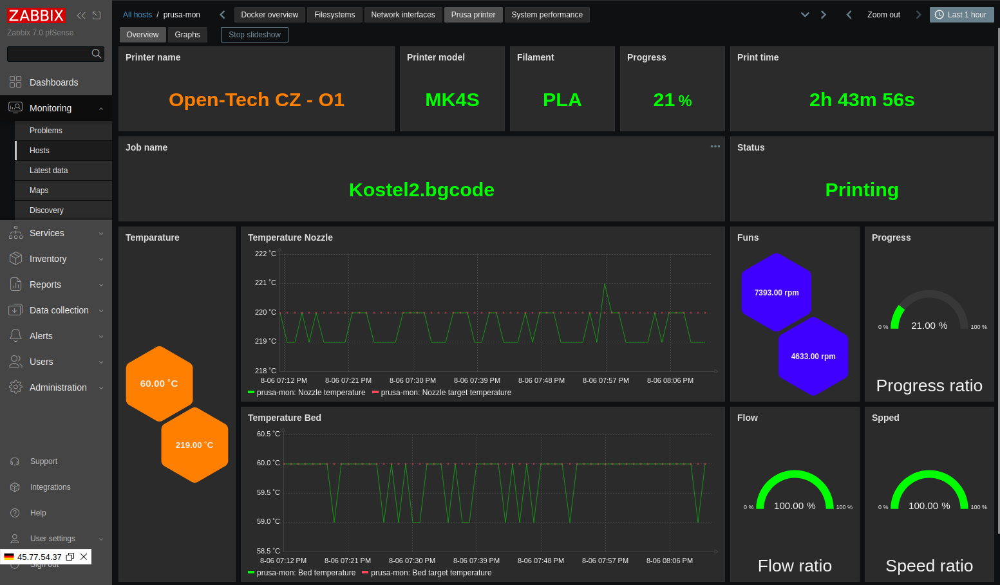
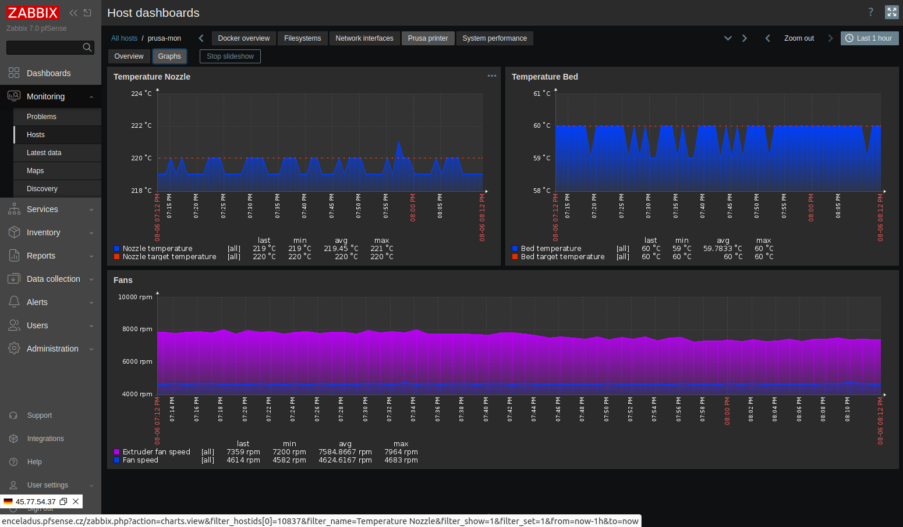

## zabbix-prusa

Monitoring Prusa printers by project [prusa_exporter](https://github.com/pstrobl96/prusa_exporter)

### Tested on Debian 12.11

- Package - docker-ce			Docker: the open-source application container engine
- Package - docker-compose-plugin	Docker Compose (V2) plugin for the Docker CLI.

### How it works

Zabbix proxy connect to prusa_expoprter and read information. Result is by
Prometeus format. Zabbix read URL - http://{$PRUSA_EXPORTER_HOST}:{$PRUSA_EXPORTER_PORT}/metrics/prusalink

Tested on Prusa MK4S

### Running docker compose only with exporter

```console
git clone https://github.com/smejdil/zabbix-prusa
git clone https://github.com/pstrobl96/prusa_exporter
cd prusa_exporter
cp docs/config/prusa.yml ./
vi prusa.yml
cp ../zabbix-prusa/docker-compose.yaml ./
docker compose up -d
```

```console
curl http://localhost:10009/metrics/prusalink
```

### Running docker container by SystemD

```console
cp docs/services/prusa-exporter-docker.service /etc/systemd/system/
vi /etc/systemd/system/prusa-exporter-docker.service
systemctl daemon-reload
systemctl enable prusa-exporter-docker.service
systemctl restart prusa-exporter-docker.service
```

### Images




### To do

- Tested on other Prusa printers
- Change tempalte with LLD
